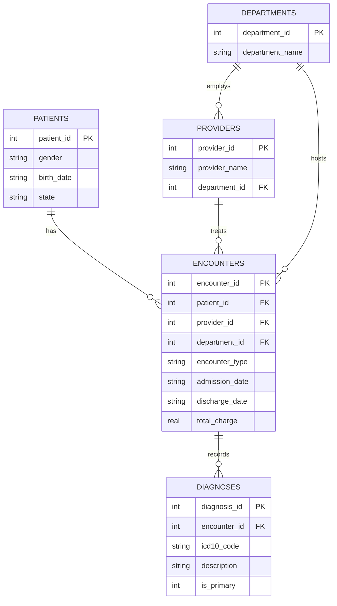

# Healthcare SQL Analytics

[](https://github.com/natheerne-hub/healthcare-sql-analytics/actions/workflows/validate-sql.yml)

### Relational Schema Design + Analytical SQL | Dr. Nather Yunis Suliaman, MD

A small healthcare data warehouse — patients, providers, departments,
encounters, and diagnoses — built to demonstrate relational schema design
and analyst-grade SQL (window functions, CTEs, self-joins, conditional
aggregation) over a realistic clinical encounter dataset.

The dataset is **fully synthetic**: patients, dates, diagnoses, and charges
are generated by a seeded random script (`generate_synthetic_data.py`), so
the entire pipeline — schema, data, and every query result below — is
reproducible from a clean checkout with two commands.

## Why this project

Most public "SQL portfolio" datasets are generic (Netflix, sales, `nycflights`).
This one models the shape of data an analyst actually works with in a
hospital setting: encounter-level grain, ICD-10 diagnosis coding, admission
and discharge timestamps, and department/provider structure — the same
entities used in the CMS HRRP and readmissions work elsewhere in this
portfolio, but here built from the ground up as a queryable relational
database rather than a downloaded CSV.

## Schema

```
patients (patient_id PK, gender, birth_date, state)
departments (department_id PK, department_name)
providers (provider_id PK, provider_name, department_id FK -> departments)
encounters (encounter_id PK, patient_id FK -> patients, provider_id FK -> providers,
            department_id FK -> departments, encounter_type, admission_date,
            discharge_date, total_charge)
diagnoses (diagnosis_id PK, encounter_id FK -> encounters, icd10_code,
           description, is_primary)
```



## Reproduce it

```bash
pip install -r requirements.txt
python generate_synthetic_data.py --db healthcare.db --seed 42
python run_queries.py --db healthcare.db
```

This generates 600 synthetic patients and ~2,350 encounters, then runs every
query in `queries/` and writes its output to `results/*.csv`. A GitHub
Actions workflow (badge above) runs this same pipeline on every push.

## Queries

| # | File | What it demonstrates |
|---|------|----------------------|
| 1 | [`01_readmission_within_30_days.sql`](queries/01_readmission_within_30_days.sql) | Self-join via `LEAD()` window function to flag 30-day inpatient readmissions, grouped by department |
| 2 | [`02_length_of_stay_by_department.sql`](queries/02_length_of_stay_by_department.sql) | Date-diff aggregation for average/max length of stay and average charge |
| 3 | [`03_diagnosis_frequency_and_cost.sql`](queries/03_diagnosis_frequency_and_cost.sql) | Diagnosis frequency ranking joined to encounter cost, with a correlated-subquery percentage |
| 4 | [`04_monthly_admission_trends.sql`](queries/04_monthly_admission_trends.sql) | Time-series bucketing with conditional aggregation (pivot-style) and a running-total window function |
| 5 | [`05_high_cost_high_readmission_patients.sql`](queries/05_high_cost_high_readmission_patients.sql) | `NTILE()` cost-decile segmentation combined with a `HAVING`-style utilization filter to flag case-management candidates |

### Sample output — Query 1: 30-day readmission rate by department

| department_name | inpatient_discharges | readmissions_within_30d | readmission_rate_pct |
|---|---:|---:|---:|
| General Surgery | 151 | 39 | 25.8 |
| Orthopedics | 137 | 34 | 24.8 |
| Emergency Medicine | 123 | 26 | 21.1 |
| Endocrinology | 115 | 24 | 20.9 |
| Cardiology | 125 | 18 | 14.4 |

*(Full output for every query is committed under [`results/`](results/), regenerated by CI on every push.)*

## Repository structure

```
schema.sql                     Table definitions, constraints, indexes
generate_synthetic_data.py     Seeded synthetic data generator (no real PHI)
run_queries.py                 Runs every query, prints + saves results
queries/                       5 analytical SQL queries
results/                       CSV output of each query (reproducible via CI)
.github/workflows/             CI pipeline that regenerates data and re-runs every query
```

## Data provenance and limitations

- All patient records, dates, diagnoses, and charges are **synthetically generated**
  with a fixed seed (`--seed 42`); no real patient data or PHI is used anywhere.
- ICD-10-CM codes and department names are realistic but the diagnosis-to-encounter
  assignment is randomized, not clinically derived — this is a SQL/data-modeling
  demonstration, not a clinical epidemiology study.
- Charge amounts are illustrative (drawn from a normal distribution per encounter
  type) and do not reflect real billing data.

## Author

**Dr. Nather Yunis Suliaman, MD**
Healthcare Data Analytics · Clinical Analytics · Health Informatics

[GitHub Profile](https://github.com/natheerne-hub)
